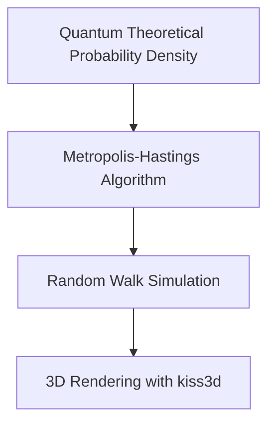

# Hydrogen Atom Orbital Visualization

## Motivation
This project visualizes the orbitals of a hydrogen atom using the **Metropolis-Hastings** algorithm, a type of Markov Chain Monte Carlo (MCMC) simulation. The goal is to represent the potential locations of an electron by performing random steps within a predefined radius. These steps are accepted or rejected based on the ratio of probability densities at the new and old positions.

The sequence of accepted positions forms a 3D random walk, with each point representing a probable location of the electron. By connecting these nodes, we can effectively visualize the shape and structure of the atomic orbital.

## Learning Objectives
This project serves as both a practical implementation and a learning exercise for the following goals:
- **Set up a Rust project:** Get comfortable with Rust's syntax, project structure, and workflow.
- **Use mathematical functions in Rust:** Implement physics-based probability functions using Rust libraries.
- **Implement the Metropolis-Hastings algorithm:** Translate prior experience in Python/R Monte Carlo simulations into Rust.
- **3D Rendering with Rust:** Visualize the 3D electron orbitals using the `kiss3d` library for real-time rendering.

## Results
Here's a sample of the `3dz²` orbital generated by the simulation:

## Project Architecture
This project follows a step-by-step pipeline for generating and rendering the orbital visualizations:

- **Quantum Theoretical Probability Density:** Defines the probability density function for electron locations based on quantum mechanics.
- **Metropolis-Hastings Algorithm:** Performs the random walk, accepting or rejecting potential electron positions based on probability ratios.
- **Random Walk Simulation:** Approved positions are stored as a sequence, representing the path of the electron.
- **3D Rendering:** The `kiss3d` library is used to render the 3D electron orbitals based on the simulation data.

