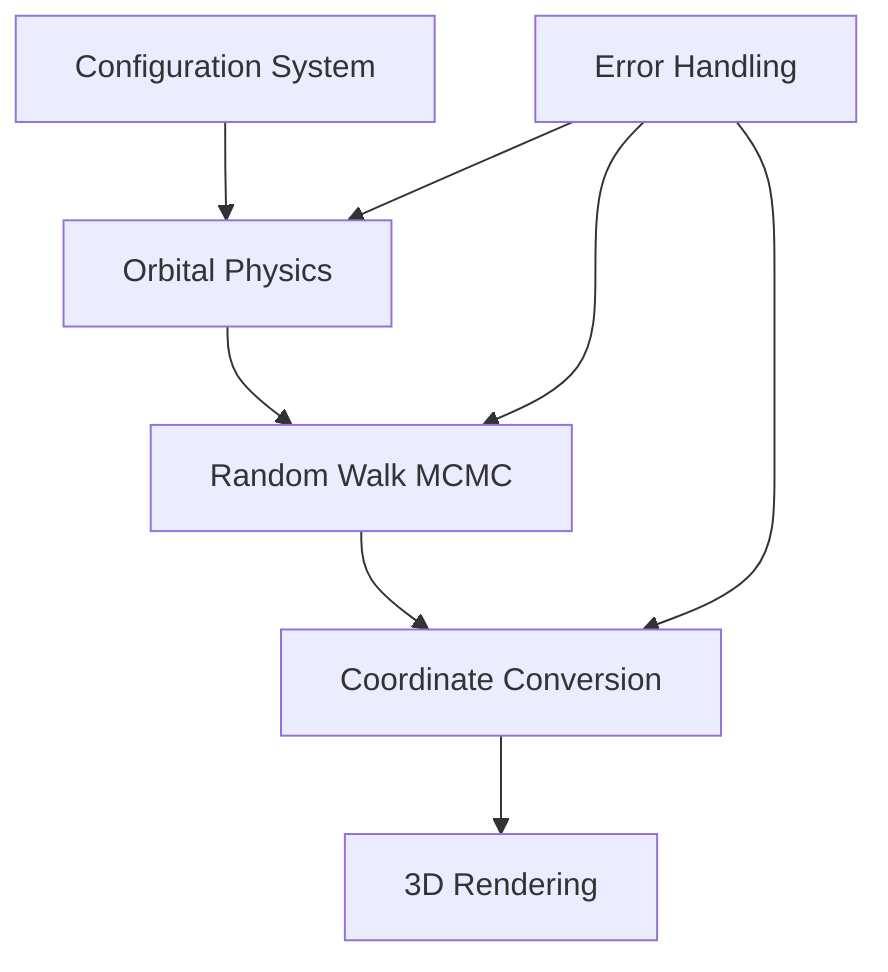

# Hydrogen Atom Orbital Visualization

## Overview
This project visualizes the orbitals of a hydrogen atom using the **Metropolis-Hastings** algorithm, a type of Markov Chain Monte Carlo (MCMC) simulation. The goal is to represent the probable locations of an electron by performing random steps within a predefined radius. These steps are accepted or rejected based on the ratio of probability densities at the new and old positions.

The sequence of accepted positions forms a 3D random walk, with each point representing a probable location of the electron. By connecting these nodes, we can effectively visualize the shape and structure of the atomic orbital.

## Features
- **Multiple Orbital Types**: Supports visualization of 1s, 2px, 2py, 2pz, and 3dz² hydrogen orbitals
- **Configurable Parameters**: Customizable simulation parameters including sample size, burn-in period, and step radius
- **Robust Error Handling**: Safe functions with comprehensive input validation and numerical error checking
- **Comprehensive Testing**: Unit tests covering coordinate conversions, orbital calculations, and edge cases
- **3D Real-time Rendering**: Interactive visualization using the `kiss3d` library

## Quick Start
```bash
# Clone and build the project
git clone <repository-url>
cd orbitals
cargo build --release

# Run with default configuration (3dz² orbital)
cargo run --release

# Run tests
cargo test
```

### Platform Compatibility
- **Linux (X11/Wayland)**: Fully supported. Wayland users benefit from automatic X11 fallback for graphics compatibility
- **macOS**: Supported
- **Windows**: Supported

## Physics Background
Hydrogen atom orbitals are described by solutions to the Schrödinger equation. Each orbital is characterized by:
- **Principal quantum number (n)**: Energy level (1, 2, 3, ...)
- **Angular momentum quantum number (l)**: Shape (s=0, p=1, d=2, ...)
- **Magnetic quantum number (m)**: Orientation (-l to +l)

The probability density |ψ(r,θ,φ)|² gives the likelihood of finding an electron at a given position in spherical coordinates.

## Learning Objectives
This project serves as both a practical implementation and a learning exercise for:
- **Rust Programming**: Project structure, error handling, testing, and documentation
- **Quantum Mechanics**: Understanding orbital shapes and probability distributions
- **Monte Carlo Methods**: Implementing the Metropolis-Hastings algorithm
- **3D Rendering**: Visualizing complex 3D data structures
- **Scientific Computing**: Numerical methods and mathematical function implementation

## Results
Here's a sample of the `3dz²` orbital generated by the simulation:


## Project Architecture
This project follows a modular architecture with clear separation of concerns:


```mermaid
graph TD
    A[Configuration System] --> B[Orbital Physics]
    B --> C[Random Walk MCMC]
    C --> D[Coordinate Conversion]
    D --> E[3D Rendering]
    F[Error Handling] --> B
    F --> C
    F --> D
```

### Module Overview
- **`config.rs`**: Configuration system for simulation parameters and orbital selection
- **`h_orbitals.rs`**: Quantum mechanical probability density functions for hydrogen orbitals
- **`random_walk.rs`**: Metropolis-Hastings MCMC implementation for orbital sampling
- **`coordinate_conversion.rs`**: Conversion between Cartesian and spherical coordinate systems
- **`render_cloud.rs`**: 3D visualization using the `kiss3d` library

### Simulation Pipeline
1. **Configuration**: Load simulation parameters (orbital type, sample size, etc.)
2. **Burn-in Period**: Initial MCMC steps to reach equilibrium distribution
3. **Production Run**: Collect representative samples of electron positions
4. **Visualization**: Render the point cloud as a 3D orbital visualization

## Available Orbitals
| Orbital | Description | Key Features |
|---------|-------------|--------------|
| 1s | Ground state | Spherically symmetric, highest probability at nucleus |
| 2px | 2p orbital along x-axis | Dumbbell shape, nodal plane at x=0 |
| 2py | 2p orbital along y-axis | Dumbbell shape, nodal plane at y=0 |
| 2pz | 2p orbital along z-axis | Dumbbell shape, nodal plane at z=0 |
| 3dz² | 3d orbital with z² symmetry | Complex shape with nodal surfaces |

## Usage Examples
The project uses a builder pattern for configuration:

```rust
use orbitals::config::{SimulationConfig, OrbitalType};

// Create a custom configuration
let config = SimulationConfig::new()
    .orbital_type(OrbitalType::Hydrogen2pz)
    .target_points(50000)
    .burn_in_steps(10000)
    .step_radius(2.0);

// Validate configuration
config.validate().expect("Invalid configuration");
```

